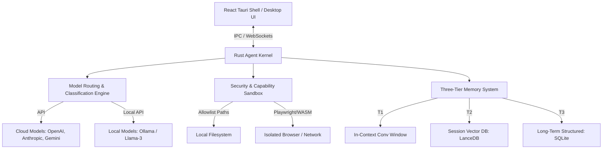

# AgentOS: The Model-Neutral Agent Kernel for Desktop

[](LICENSE)
[](https://github.com/agentos-project/agentos/actions)
[]()
[]()

> **AgentOS** is a model-neutral agent kernel for desktop — the operating layer that lets any AI model control any computer, at any cost, without vendor lock-in.

Unlike vertically integrated solutions that tie you to a single model provider (such as OpenAI Operator, Anthropic Computer Use, or Google Mariner), AgentOS is a neutral runtime kernel designed to run locally, schedule across heterogeneous models, and support a rich ecosystem of third-party **Agent Packs**.

---

## 🚀 Key Pillars

*   **🔒 Local-First Execution**: Maximum privacy and CISO-friendly security. All memory, local model coordination (via Ollama), sandboxing, and execution happen on your local machine.
*   **⚖️ Model Neutrality**: Run a single workspace with different tasks routed dynamically to their optimal models (e.g., Gemini for reasoning, Claude for coding, local Llama-3 for quick checks) based on latency, privacy, and cost.
*   **🔌 Agent Pack Ecosystem**: An open-kernel API allowing developers to build and share capabilities like VS Code extensions. Start with pre-built packs or build custom agents.

---

## 🛠️ Architecture Overview

AgentOS is built as a high-performance desktop application split into two primary layers:



### Core Technologies
*   **Kernel**: Rust (Tokio Async, Actix Actor model, memory-safety, zero GC pauses).
*   **Shell**: Tauri + React + TypeScript + Vite (low memory footprint, system keychain integration).
*   **Sandbox**: WASM (Wasmtime runtime for plugin isolation) & Playwright (for sandboxed browser actions).
*   **Memory**: SQLite & LanceDB (local vector storage).

---

## 📂 Repository Structure

```text
agentOS/
├── .github/workflows/    # CI/CD Workflows (Tauri and React compilers)
├── src/                  # React Frontend (Desktop Dashboard & Workspaces)
│   ├── assets/           # UI Icons & Assets
│   ├── components/       # Premium React Components (Agent Graph, Code Preview)
│   └── index.css         # Styling system & Tailwind-like dark CSS
├── src-tauri/            # Tauri App Native Desktop Files
│   ├── src/              # Rust Kernel & Command Handlers
│   ├── Cargo.toml        # Rust Crate Metadata & dependencies
│   └── tauri.conf.json   # Tauri Application configuration
├── .env.example          # Environment variable template
├── CONTRIBUTING.md       # Development guideline for contributors
├── LICENSE               # MIT License
└── README.md             # This documentation
```

---

## 📦 Phase 1 MVP Features

The current implementation showcases the **Developer Workspace** MVP:
1.  **Multi-Agent Coordination Panel**: Watch the 4 core agents (**Architect**, **Backend**, **Frontend**, **QA**) communicate over the WebSocket message queue in real-time.
2.  **Live Token & Cost Tracker**: Understand exactly what a prompt costs as it executes.
3.  **Active Sandbox Code Preview**: paste a spec, let the agents design/build/audit, and interact with the resulting HTML/JS/CSS code in a running sandbox frame inside the app.
4.  **Model Routing Panel**: Assign different models to different agent roles.

---

## 💻 Developer Quick Start

### Prerequisites
*   Node.js (v18+)
*   npm (v9+)
*   *Optional for Native Build*: Rust and Cargo (see [Tauri installation guides](https://tauri.app/v1/guides/getting-started/prerequisites)).

### Setup Instructions

1.  **Clone the Repository**
    ```bash
    git clone https://github.com/yourusername/agentOS.git
    cd agentOS
    ```

2.  **Install Node Dependencies**
    ```bash
    npm install
    ```

3.  **Configure Environment Variables**
    Copy the `.env.example` file and add your credentials if using cloud models:
    ```bash
    cp .env.example .env
    ```

4.  **Run Development Server**
    Run the Vite React development server to preview and test the UI in the browser:
    ```bash
    npm run dev
    ```

5.  **Run Tauri (Native Application)**
    *(Requires Rust install)*
    ```bash
    npm run tauri dev
    ```

---

## 🔒 Security Posture

AgentOS operates on the **Principle of Least Privilege**:
*   **Action Log**: Immutable audit trail of every system action (terminal, browser, file writes) with user confirmation gates.
*   **Secrets Storage**: Decrypted only in-memory and retrieved from OS-native Keychains (Credential Manager, Keychain Daemon).
*   **Plugin Isolation**: All Agent Packs run inside WASM containers without default filesystem or network access.

---

## 🗺️ Roadmap

- [x] **Phase 1: Kernel & Shell Core MVP** (Developer Workspace, 4-Agent Team, Sandbox Preview, Cost tracker).
- [ ] **Phase 2: Agent Pack API & Marketplace** (Browser automation, Session memory, lanceDB integrations).
- [ ] **Phase 3: Platform OS Metaphor** (On-premises deployment, team accounts, native app control).

---

## 📄 License

Distributed under the MIT License. See [LICENSE](LICENSE) for more information.


